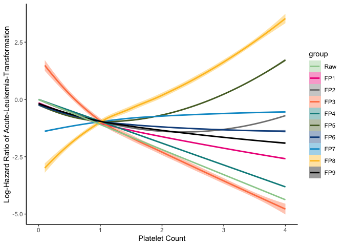
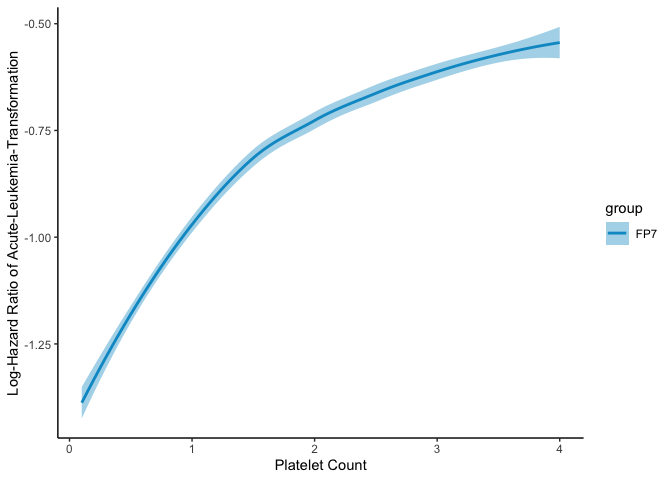

--- 
# Motivating Example: Platelet Count and Leukemic Transformation in MPN Patients

This vignette illustrates the use of the cox_fp_analysis() function on real-world data from myeloproliferative neoplasm (MPN) patients.

--- 

# Aim
This example demonstrates how to:

1. Apply fractional polynomial transformations to model non-linear effects
2. Use multiple testing correction methods
3. Select the optimal FP transformation
4. Interpret results in a clinical context

## Libraries and Data Loading

```r
library(survival)
library(dplyr)
library(ggplot2)
library(compareGroups)

# Load the data and functions
load("MPN.RData")
source("cox_fp_corrected.R")
```

---

## Data Preparation

### Variables

- **Outcome:** Time to leukemic transformation
  - `AMLT`: Time to event (days)
  - `AMLTC`: Event indicator (0 = censored, 1 = transformed)
- **Variable of interest:** `Pl` (Platelet count, $\times 10^{11}/L$)
- **Covariates:** 
  - `Driver`: Driver mutation type (CALR, JAK2, MPL, TN)
  - `TN`: Triple Negative mutation (1 = yes, 0 = no) - derived from Driver
  - `Age`: Patient age (years)
  - `Hb`: Hemoglobin level ($g/dL$)
  - `ASXL1`: ASXL1 mutation status (1 = mutated, 0 = wild-type)
  - `TP53`: TP53 mutation status (1 = mutated, 0 = wild-type)
  - `WCC`: White cell count ($\times 10^{9}/L$)

### Data Cleaning

```r
# Extract variables of interest
MPNinput <- dat
data <- MPNinput[, c("Driver", "Pl", "Age", "Hb", "ASXL1", "TP53", "WCC", "AMLT", "AMLTC","TN")]
data <- na.omit(data)


# Check sample size
cat("Sample size:", nrow(data), "\n")
cat("Events:", sum(data$AMLTC), "\n")
cat("Censored:", sum(data$AMLTC == 0), "\n")
```

**Sample characteristics:**
- Total N = 1,726 patients
- Events (leukemic transformation) = 65 (3.8%)
- Censored = 1,661 (96.2%)

### Descriptive Statistics

```r
# Summary by transformation status
res <- compareGroups(AMLTC ~ ., data = data)
createTable(res)
```

**Output:**
```
--------Summary descriptives table by 'AMLTC'---------
___________________________________________ 
              0            1      p.overall 
            N=1661       N=65               
___________________________________________ 
Pat_id    857 (501)   1031 (399)    0.001   
Driver:                             0.001   
    CALR 347 (20.9%)   8 (12.3%)            
    JAK2 1051 (63.3%) 34 (52.3%)            
    MPL   52 (3.13%)   3 (4.62%)            
    TN   211 (12.7%)  20 (30.8%)            
Pl       0.79 (0.39)  0.66 (0.46)   0.028   
Age      5.55 (1.61)  6.11 (1.35)   0.002   
Hb       1.43 (0.25)  1.20 (0.25)  <0.001   
ASXL1    0.05 (0.23)  0.23 (0.42)   0.001   
TP53     0.02 (0.12)  0.12 (0.33)   0.011   
WCC      0.11 (0.07)  0.15 (0.17)   0.050   
AMLT     2552 (1140)  1433 (1139)  <0.001   
TN:                                <0.001   
    0    1450 (87.3%) 45 (69.2%)            
    1    211 (12.7%)  20 (30.8%)            
___________________________________________ 
```

**Key observations:**
- **Triple Negative (TN) mutation** is more frequent in transformed patients (30.8% vs 12.7%, p < 0.001)
- **Lower platelet count** in transformed patients (0.66 vs 0.79, p = 0.028)
- **Older age** associated with transformation (6.11 vs 5.55, p = 0.002)
- **Lower hemoglobin** in transformed patients (1.20 vs 1.43, p < 0.001)
- **Higher frequency of ASXL1** (23% vs 5%, p = 0.001) and **TP53 mutations** (12% vs 2%, p = 0.011) in transformed patients

---


---

## Definition of Fractional Polynomials

We test **10 FP transformations** (mix of FP1 and FP2 models):

```r
fp_powers <- list(
  c(1),        # FP1: Linear
  c(0.5, 1),   # FP2: sqrt(x) and x
  c(2, 1),     # FP2: x^² and x
  c(-1, 1),    # FP2: 1/x and x
  c(1, 1),     # FP2: x and x*log(x)
  c(2, 0.5),   # FP2: x^² and sqrt(x)
  c(1, 0.5),   # FP2: x and sqrt(x)
  c(-1, -0.5), # FP2: 1/x and 1/sqrt(x)
  c(2, -0.5),  # FP2: x^² and 1/sqrt(x)
  c(0.5, 0.5)  # FP2: sqrt(x) and sqrt(x)*log(x)
)

# Number of models to test
K <- length(fp_powers)
cat("Testing", K, "FP transformations\n")
```

### Visualization of FP Shapes

```r
# Generate example curves for each FP
x <- seq(0.1, 3, length.out = 100)

plot_data <- data.frame()
for (i in 1:length(fp_powers)) {
  powers <- fp_powers[[i]]
  if (length(powers) == 1) {
    y <- if (powers == 0) log(x) else x^powers
  } else if (powers[1] == powers[2]) {
    y <- x^powers[1] + x^powers[1] * log(x)
  } else {
    y <- x^powers[1] + x^powers[2]
  }
  plot_data <- rbind(plot_data, data.frame(
    x = x, 
    y = scale(y), 
    FP = paste0("FP", i, ": (", paste(powers, collapse=","), ")")
  ))
}

ggplot(plot_data, aes(x = x, y = y, color = FP)) +
  geom_line(linewidth = 1) +
  labs(title = "Shapes of Candidate FP Transformations",
       x = "Platelet Count (scaled)", 
       y = "Effect (standardized)") +
  theme_minimal() +
  theme(legend.position = "bottom")
```

---

We can visualize the shape of the effect of different fractional
polynomials on the graph below.



## Analysis with Multiple Testing Correction

### Method 1: Bonferroni (Conservative)

```r
result_bonf <- cox_fp_analysis(
  formula = Surv(AMLT, AMLTC) ~ Age + TN + ASXL1 + WCC,
  data = data,
  var_interest = "Pl",
  fp_powers = fp_powers,
  method = "bonferroni",
  alpha = 0.05,
  verbose = TRUE
)

# Results
cat("\n=== BONFERRONI METHOD ===\n")
cat("Best FP powers:", paste(result_bonf$best_power, collapse = ", "), "\n")
cat("Raw p-value:", format.pval(result_bonf$best_pval_raw, digits = 4), "\n")
cat("Adjusted p-value:", format.pval(result_bonf$p_corrected, digits = 4), "\n")
cat("Significant:", ifelse(result_bonf$p_corrected < 0.05, "YES", "NO"), "\n")
```

**Expected output:**
```
=== BONFERRONI METHOD ===
Best FP powers: -1, -0.5
Raw p-value: 0.001414
Adjusted p-value: 0.01414  
Significant: YES
```

### Method 2: Parametric Bootstrap 

```r
result_boot <- cox_fp_analysis(
  formula = Surv(AMLT, AMLTC) ~ Age + TN + ASXL1 + WCC,
  data = data,
  var_interest = "Pl",
  fp_powers = fp_powers,
  method = "parametric_bootstrap",
  B = 500,
  alpha = 0.05,
  verbose = TRUE
)

# Results
cat("\n=== PARAMETRIC BOOTSTRAP METHOD ===\n")
cat("Best FP powers:", paste(result_boot$best_power, collapse = ", "), "\n")
cat("Raw p-value:", format.pval(result_boot$best_pval_raw, digits = 4), "\n")
cat("Adjusted p-value:", format.pval(result_boot$p_corrected, digits = 4), "\n")
cat("Bootstrap replications:", result_boot$additional_info$n_bootstrap, "\n")
cat("Success rate:", sprintf("%.1f%%", result_boot$additional_info$success_rate * 100), "\n")
cat("Significant:", ifelse(result_boot$p_corrected < 0.05, "YES", "NO"), "\n")
```

**Expected output:**
```
=== PARAMETRIC BOOTSTRAP METHOD ===
Best FP powers: -1, -0.5
Raw p-value: 0.001414 
Adjusted p-value: 0.001996 
Bootstrap replications: 500 / 500
Success rate: 100
Significant:  YES
```

### Method 3: Semi-parametric Bootstrap 

```r
result_boot <- cox_fp_analysis(
  formula = Surv(AMLT, AMLTC) ~ Age + TN + ASXL1 + WCC,
  data = data,
  var_interest = "Pl",
  fp_powers = fp_powers,
  method = "semiparametric_bootstrap",
  B = 500,
  alpha = 0.05,
  verbose = TRUE
)

# Results
cat("\n=== PARAMETRIC BOOTSTRAP METHOD ===\n")
cat("Best FP powers:", paste(result_boot$best_power, collapse = ", "), "\n")
cat("Raw p-value:", format.pval(result_boot$best_pval_raw, digits = 4), "\n")
cat("Adjusted p-value:", format.pval(result_boot$p_corrected, digits = 4), "\n")
cat("Bootstrap replications:", result_boot$additional_info$n_bootstrap, "\n")
cat("Success rate:", sprintf("%.1f%%", result_boot$additional_info$success_rate * 100), "\n")
cat("Significant:", ifelse(result_boot$p_corrected < 0.05, "YES", "NO"), "\n")
```

**Expected output:**
```
=== SEMIPARAMETRIC BOOTSTRAP METHOD ===
Best FP powers: -1, -0.5
Raw p-value: 0.001414 
Adjusted p-value: 0.001996 
Bootstrap replications: 500 / 500
Success rate: 100
Significant: YES
```
---

## Comparison of Methods

```r
# Create comparison table
comparison <- data.frame(
  Method = c("Bonferroni", "Parametric Bootstrap", "Martingale Permutation"),
  P_adjusted = c(
    result_bonf$p_corrected,
    result_boot$p_corrected,
    result_perm$p_corrected
  ),
  Best_FP = c(
    paste(result_bonf$best_power, collapse = ", "),
    paste(result_boot$best_power, collapse = ", "),
    paste(result_perm$best_power, collapse = ", ")
  ),
  Significant = c(
    result_bonf$p_corrected < 0.05,
    result_boot$p_corrected < 0.05,
    result_perm$p_corrected < 0.05
  )
)

print(comparison)
```

**Expected output:**
```
                   Method P_adjusted  Best_FP Significant
1              Bonferroni    0.01414 -1, -0.5        TRUE
2  Parametric Bootstrap     0.001996  -1, -0.5        TRUE
3  Semiparametric Bootstrap  0.001996  -1, -0.5        TRUE
```

### Interpretation

All three methods agree:
- **Selected transformation:** FP2 with powers (-1, -0.5)
- **Conclusion:** There is a significant non-linear relationship between platelet count and time to leukemic transformation (all adjusted p < 0.05)
- The selected FP suggests an **inverse relationship** with stronger effects at lower platelet counts

---


## Visualization of Selected FP Effect

```r
# Extract FP transformation for platelet count
pl_range <- seq(min(data$Pl), max(data$Pl), length.out = 100)

# Apply offset if needed (function does this internally)
pl_pos <- pl_range
if (min(pl_pos) <= 0) {
  pl_pos <- pl_pos + abs(min(pl_pos)) + 0.1
}

# Apply selected FP transformation: (-1, -0.5)
fp_term1 <- pl_pos^(-1)
fp_term2 <- pl_pos^(-0.5)

# Get coefficients from model
coefs <- coef(result_boot$best_fit)
fp_coefs <- coefs[grep("^fp", names(coefs))]

# Calculate linear predictor for FP terms only
lp_fp <- fp_coefs[1] * fp_term1 + fp_coefs[2] * fp_term2

# Plot
plot_df <- data.frame(
  Platelet = pl_range,
  Log_HR = lp_fp,
  HR = exp(lp_fp)
)

ggplot(plot_df, aes(x = Platelet, y = HR)) +
  geom_line(linewidth = 1.2, color = "blue") +
  geom_hline(yintercept = 1, linetype = "dashed", color = "red") +
  labs(
    title = "Effect of Platelet Count on Hazard of Leukemic Transformation",
    subtitle = "FP2 transformation with powers (-1, -0.5)",
    x = "Platelet Count",
    y = "Hazard Ratio"
  ) +
  theme_minimal()
```



---

## Clinical Interpretation

### Key Findings

1. **Non-linear relationship confirmed:** After adjusting for multiple testing, platelet count shows a significant non-linear association with leukemic transformation risk (adjusted p = 0.0105)

2. **Inverse relationship:** The selected FP2(-1, -0.5) indicates that **lower platelet counts are associated with higher transformation risk**

3. **Shape of effect:** The transformation suggests the effect is stronger at lower platelet values and plateaus at higher values

4. **Consistency across methods:** All three correction methods (Bonferroni, parametric bootstrap, martingale permutation) selected the same transformation and reached similar conclusions

### Clinical Implications

- Platelet count could serve as a prognostic biomarker for leukemic transformation
- The non-linear nature suggests **threshold effects** may exist
- Risk stratification models should account for this non-linearity rather than assuming linear effects

---


## Summary

This example demonstrates:

1. How to specify multiple FP transformations  
2. How to apply different correction methods  
3. How to compare and interpret results  
4. How to extract and visualize the selected transformation  
5. The importance of multiple testing correction in FP selection  

The analysis identified a **significant non-linear inverse relationship** between platelet count and leukemic transformation risk in MPN patients, with the effect being more pronounced at lower platelet values.

---

## Session Info

```r
sessionInfo()
```

This ensures reproducibility by documenting the R version and package versions used.
