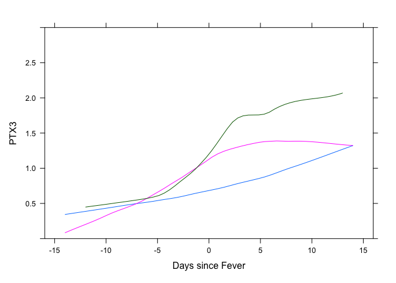
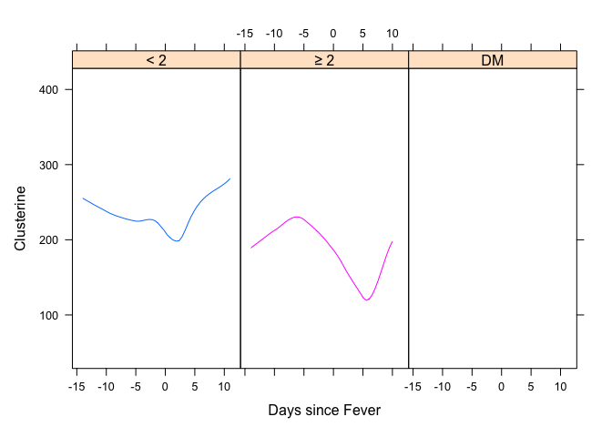
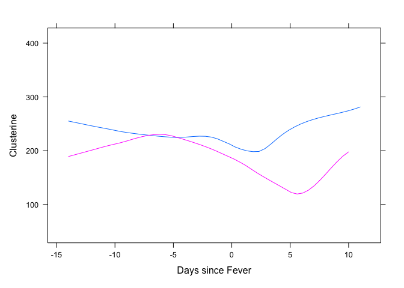
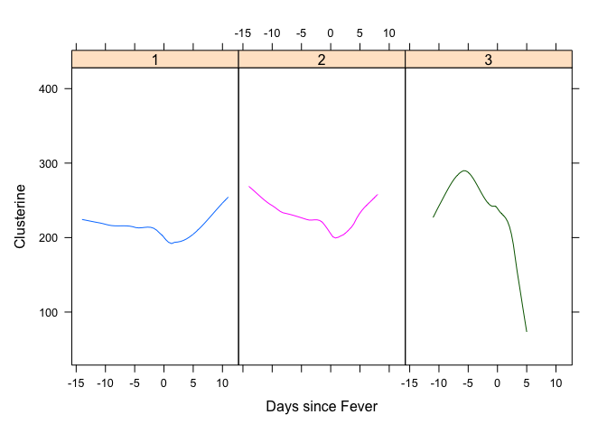
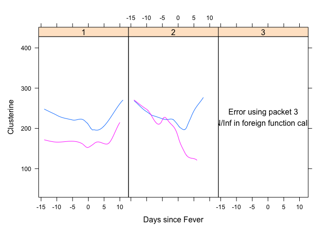
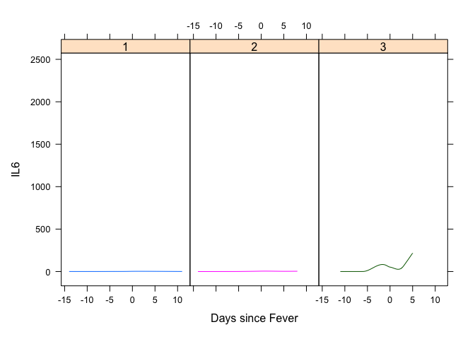
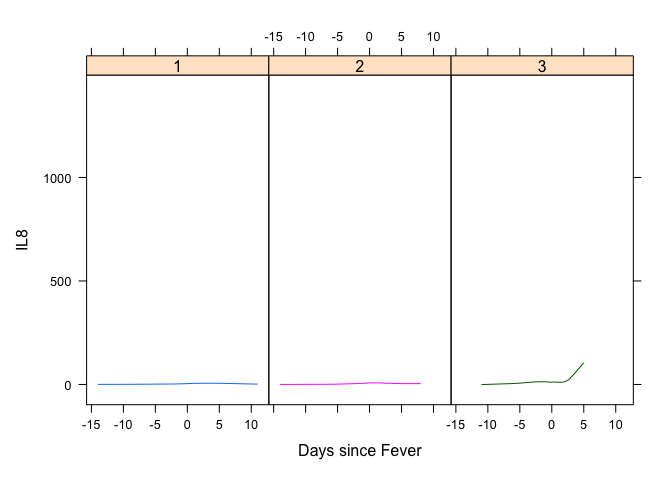
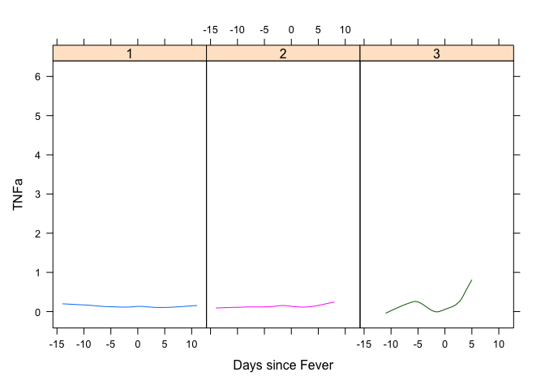

# Rapport d’analyse de l’étude PTX3

Ce document a pour objectif de résumer l’ensemble des résultats obtenus
dans le cadre de cette étude PTX3.

# Descriptif de la base de données

## PTX3

    ##                                  Level     N    %
    ## 1                       Sexe         1   346 61.7
    ## 2                                    2   215 38.3
    ## 3                 Pathologie         1   284 50.6
    ## 4                                    2    21  3.7
    ## 5                                    3   179 31.9
    ## 6                                    4    77 13.7
    ## 7                       SOFA       < 2   432 77.0
    ## 8                                  ≥ 2   117 20.9
    ## 9                                   DM    11  2.0
    ## 10                                  NA     1  0.2
    ## 11             Groupe.fievre         1   318 56.7
    ## 12                                   2   190 33.9
    ## 13                                   3    53  9.4
    ## 14    Documentation.microbio         0   262 46.7
    ## 15                                   1   297 52.9
    ## 16                                  DM     2  0.4
    ## 17 Documentation.bacterienne         0   285 50.8
    ## 18                                   1   274 48.8
    ## 19                                  DM     2  0.4
    ## 20    Documentation.fongique         0   501 89.3
    ## 21                                   1    58 10.3
    ## 22                                  DM     2  0.4
    ## 23    Documentation.imagerie         0   349 62.2
    ## 24                                   1   168 29.9
    ## 25                                   2    38  6.8
    ## 26                                   3     4  0.7
    ## 27                                  DM     2  0.4
    ## 28                     deces         1    17  3.0
    ## 29                           <Missing>   544 97.0

    ##                      N Missing   Mean    SD      Min    Q1 Median   Q3   Max
    ## 1 Jour.d.evolution 560       1   1.47  9.47   -65.00 -3.00   0.00 6.00  42.0
    ## 2      PTX3.Valeur 550      11   2.76 10.95    -0.03  0.38   0.75 1.54 128.2

## CLUSTERINE

    ##                                  Level     N    %
    ## 1                       Sexe         1   171 62.2
    ## 2                                    2   104 37.8
    ## 3                 Pathologie         1   122 44.4
    ## 4                                    2    10  3.6
    ## 5                                    3    99 36.0
    ## 6                                    4    44 16.0
    ## 7                       SOFA       < 2   216 78.5
    ## 8                                  ≥ 2    57 20.7
    ## 9                                   DM     2  0.7
    ## 10             Groupe.fievre         1   158 57.5
    ## 11                                   2    93 33.8
    ## 12                                   3    24  8.7
    ## 13    Documentation.microbio         0   121 44.0
    ## 14                                   1   152 55.3
    ## 15                                  DM     2  0.7
    ## 16 Documentation.bacterienne         0   134 48.7
    ## 17                                   1   139 50.5
    ## 18                                  DM     2  0.7
    ## 19    Documentation.fongique         0   244 88.7
    ## 20                                   1    29 10.5
    ## 21                                  DM     2  0.7
    ## 22    Documentation.imagerie         0   177 64.4
    ## 23                                   1    78 28.4
    ## 24                                   2    18  6.5
    ## 25                                  DM     2  0.7
    ## 26                     deces         1     8  2.9
    ## 27                           <Missing>   267 97.1

    ##                       N Missing     Mean     SD      Min     Q1 Median     Q3     Max
    ## 1  Jour.d.evolution 275       0    -1.78   5.89   -22.00  -5.00   0.00   2.00   21.00
    ## 2       PTX3.Valeur 273       2     3.09  13.35    -0.03   0.31   0.61   1.26  128.20
    ## 3               PNN  69     206     2.97   2.16     0.18   1.54   2.50   4.17   11.94
    ## 4               PCT  62     213     0.22   0.38     0.02   0.06   0.11   0.19    2.16
    ## 5               CRP  55     220    34.85  45.71     3.00   8.00  16.00  45.00  234.00
    ## 6             IL.1b 274       1     0.38   0.72     0.00   0.00   0.00   0.74    8.39
    ## 7              IL.8 275       0    21.27 115.65     0.00   0.60   2.47  11.00 1396.89
    ## 8              IL.6 275       0    26.21 156.40     0.00   0.00   1.34   6.70 2406.28
    ## 9              TNFa 275       0     0.25   0.58     0.00   0.00   0.10   0.27    5.98
    ## 10       CLUSTERINE 275       0   212.10  70.88    53.34 153.70 215.50 262.36  403.60

# ANALYSE LONGITUDINALE PTX3

Dans un premier temps, l’objectif consiste à étudier les critères
impactant la trajectoire de PTX3. Ici, nous observons une évolution
significative de la valeur de PTX3 au cours du temps (p=0.0037), et
cette évolution semble différente entre les groupe de fièvre. Cette
différence est significative entre les groupe (3vs1) - p=0.0042. Cette
différence peut être observée sur le graphique suivant.

    ## Linear mixed model fit by REML ['lmerMod']
    ## Formula: PTX3.Valeur ~ Jour.d.evolution + Jour.d.evolution^2 + Documentation.fongique +  
    ##     SOFA + Groupe.fievre + Sexe + Pathologie + (1 | N.Inclusion)
    ##    Data: data2b
    ## 
    ## REML criterion at convergence: 3701.3
    ## 
    ## Scaled residuals: 
    ##     Min      1Q  Median      3Q     Max 
    ## -2.1978 -0.2123 -0.0955 -0.0062 10.1647 
    ## 
    ## Random effects:
    ##  Groups      Name        Variance Std.Dev.
    ##  N.Inclusion (Intercept)  17.26    4.155  
    ##  Residual                114.89   10.718  
    ## Number of obs: 487, groups:  N.Inclusion, 106
    ## 
    ## Fixed effects:
    ##                          Estimate Std. Error t value
    ## (Intercept)               0.98026    1.32923   0.737
    ## Jour.d.evolution          0.22483    0.08402   2.676
    ## Documentation.fongique1  -2.47509    2.35245  -1.052
    ## Documentation.fongiqueDM -1.21003    8.59442  -0.141
    ## SOFA≥ 2                   0.54166    2.07951   0.260
    ## SOFADM                   -1.29368    4.25949  -0.304
    ## Groupe.fievre2            1.87260    1.44683   1.294
    ## Groupe.fievre3            7.14229    2.71253   2.633
    ## Sexe2                     0.73662    1.42112   0.518
    ## Pathologie2              -0.30606    3.53569  -0.087
    ## Pathologie3               1.71099    1.48870   1.149
    ## Pathologie4              -0.16574    1.92245  -0.086
    ## 
    ## Correlation of Fixed Effects:
    ##             (Intr) Jr.d.v Dcmn.1 Dcm.DM SOFA≥2 SOFADM Grp.f2 Grp.f3 Sexe2  Pthlg2 Pthlg3
    ## Jour.d.vltn -0.094                                                                      
    ## Dcmnttn.fn1  0.037 -0.028                                                               
    ## Dcmnttn.fDM  0.004  0.039  0.060                                                        
    ## SOFA≥ 2     -0.331  0.042 -0.365 -0.162                                                 
    ## SOFADM      -0.060 -0.019 -0.014  0.024  0.042                                          
    ## Groupe.fvr2 -0.348 -0.013 -0.147  0.021  0.122  0.129                                   
    ## Groupe.fvr3 -0.068  0.022 -0.089  0.085 -0.447  0.015  0.177                            
    ## Sexe2       -0.506 -0.026  0.017 -0.092  0.130 -0.196 -0.021  0.057                     
    ## Pathologie2 -0.272  0.061 -0.110  0.016  0.022  0.017  0.039  0.083  0.110              
    ## Pathologie3 -0.493  0.073 -0.102  0.029  0.099  0.024 -0.123 -0.102  0.108  0.195       
    ## Pathologie4 -0.435  0.172  0.013  0.025  0.089 -0.060 -0.053 -0.070  0.125  0.151  0.358

# ANALYSE LONGITUDINALE CLUSTERINE

Dans un premier temps, l’objectif consiste à étudier les critères
impactant la trajectoire de la clusterine. Ici, nous observons une
évolution significative de la valeur de Clusterine au cours du temps
(p\<0.0001), et cette évolution semble différente entre les groupe de
fièvre. Cette différence est significative entre les groupe (3vs1) -
p=0.0409. Cette évolution est également différente entre les deux
groupes basés sur le score SOFA - p=0.0127. Ces différences peuvent être
observées sur les graphiques suivants.

    ## Linear mixed model fit by REML ['lmerMod']
    ## Formula: CLUSTERINE ~ Jour.d.evolution + Jour.d.evolution^2 + Documentation.fongique +  
    ##     SOFA + Groupe.fievre + Sexe + Pathologie + (1 | N.Inclusion)
    ##    Data: data1b
    ## 
    ## REML criterion at convergence: 2775.7
    ## 
    ## Scaled residuals: 
    ##      Min       1Q   Median       3Q      Max 
    ## -2.63491 -0.47350 -0.06253  0.46394  2.72119 
    ## 
    ## Random effects:
    ##  Groups      Name        Variance Std.Dev.
    ##  N.Inclusion (Intercept) 2998     54.75   
    ##  Residual                1697     41.19   
    ## Number of obs: 263, groups:  N.Inclusion, 101
    ## 
    ## Fixed effects:
    ##                          Estimate Std. Error t value
    ## (Intercept)              211.9534    12.6595  16.743
    ## Jour.d.evolution          -2.7911     0.5371  -5.197
    ## Documentation.fongique1   -1.7301    22.4311  -0.077
    ## Documentation.fongiqueDM -22.4718    44.6335  -0.503
    ## SOFA≥ 2                  -42.4979    19.0257  -2.234
    ## SOFADM                   -60.2938    63.2558  -0.953
    ## Groupe.fievre2             6.7507    13.2178   0.511
    ## Groupe.fievre3            45.2802    26.0161   1.740
    ## Sexe2                      4.5140    13.1426   0.343
    ## Pathologie2               31.4965    32.9356   0.956
    ## Pathologie3               -6.4943    14.2893  -0.454
    ## Pathologie4              -15.3172    17.5839  -0.871
    ## 
    ## Correlation of Fixed Effects:
    ##             (Intr) Jr.d.v Dcmn.1 Dcm.DM SOFA≥2 SOFADM Grp.f2 Grp.f3 Sexe2  Pthlg2 Pthlg3
    ## Jour.d.vltn  0.033                                                                      
    ## Dcmnttn.fn1  0.020 -0.006                                                               
    ## Dcmnttn.fDM  0.006  0.051  0.048                                                        
    ## SOFA≥ 2     -0.326  0.008 -0.345 -0.134                                                 
    ## SOFADM      -0.089 -0.009 -0.009  0.013  0.039                                          
    ## Groupe.fvr2 -0.314  0.004 -0.138  0.017  0.106  0.064                                   
    ## Groupe.fvr3 -0.025 -0.014 -0.133  0.061 -0.415 -0.005  0.182                            
    ## Sexe2       -0.535 -0.030  0.025 -0.073  0.128 -0.101 -0.006  0.046                     
    ## Pathologie2 -0.264  0.028 -0.117  0.015  0.018  0.032  0.029  0.070  0.100              
    ## Pathologie3 -0.522  0.045 -0.099  0.024  0.113  0.076 -0.121 -0.148  0.133  0.204       
    ## Pathologie4 -0.467  0.059  0.032  0.021  0.091  0.062 -0.069 -0.119  0.150  0.158  0.394

# ANALYSE LONGITUDINALE IL6

Dans un premier temps, l’objectif consiste à étudier les critères
impactant la trajectoire de l’IL6. Ici, nous observons une valeur
moyenne de l’IL6 différente entre les groupe de fièvre. Cette différence
est significative entre les groupe (3vs1) - p\<0.0001.

Cette différence peut être observée sur le graphique suivant.

    ## Linear mixed model fit by REML ['lmerMod']
    ## Formula: IL.6 ~ Jour.d.evolution + Documentation.fongique + SOFA + Groupe.fievre +      Sexe + Pathologie + (1 | N.Inclusion)
    ##    Data: data1b
    ## 
    ## REML criterion at convergence: 3286.9
    ## 
    ## Scaled residuals: 
    ##     Min      1Q  Median      3Q     Max 
    ## -1.6604 -0.1630 -0.0487  0.0416 14.0580 
    ## 
    ## Random effects:
    ##  Groups      Name        Variance Std.Dev.
    ##  N.Inclusion (Intercept)  1077     32.81  
    ##  Residual                23054    151.84  
    ## Number of obs: 263, groups:  N.Inclusion, 101
    ## 
    ## Fixed effects:
    ##                          Estimate Std. Error t value
    ## (Intercept)                29.977     20.697   1.448
    ## Jour.d.evolution            1.966      1.852   1.062
    ## Documentation.fongique1    24.405     36.822   0.663
    ## Documentation.fongiqueDM  -13.065    116.786  -0.112
    ## SOFA≥ 2                    -3.857     31.328  -0.123
    ## SOFADM                      3.735    114.234   0.033
    ## Groupe.fievre2             11.884     22.388   0.531
    ## Groupe.fievre3            164.822     42.432   3.884
    ## Sexe2                     -10.608     21.807  -0.486
    ## Pathologie2               -30.553     56.551  -0.540
    ## Pathologie3               -28.818     23.355  -1.234
    ## Pathologie4               -26.068     29.503  -0.884
    ## 
    ## Correlation of Fixed Effects:
    ##             (Intr) Jr.d.v Dcmn.1 Dcm.DM SOFA≥2 SOFADM Grp.f2 Grp.f3 Sexe2  Pthlg2 Pthlg3
    ## Jour.d.vltn  0.091                                                                      
    ## Dcmnttn.fn1  0.022 -0.009                                                               
    ## Dcmnttn.fDM  0.008  0.001  0.085                                                        
    ## SOFA≥ 2     -0.330  0.023 -0.357 -0.226                                                 
    ## SOFADM      -0.084 -0.022 -0.006  0.023  0.032                                          
    ## Groupe.fvr2 -0.310 -0.026 -0.146  0.033  0.107  0.065                                   
    ## Groupe.fvr3 -0.032 -0.033 -0.106  0.105 -0.412  0.000  0.188                            
    ## Sexe2       -0.514 -0.056  0.013 -0.129  0.143 -0.097 -0.045  0.032                     
    ## Pathologie2 -0.269  0.047 -0.099  0.016  0.033  0.025  0.032  0.058  0.122              
    ## Pathologie3 -0.500  0.092 -0.091  0.038  0.111  0.069 -0.138 -0.145  0.107  0.197       
    ## Pathologie4 -0.440  0.106  0.049  0.031  0.075  0.050 -0.095 -0.118  0.146  0.154  0.391

# ANALYSE LONGITUDINALE IL8

Dans un premier temps, l’objectif consiste à étudier les critères
impactant la trajectoire de l’IL8. Ici, nous observons une valeur
moyenne de l’IL8 différente entre les groupe de fièvre. Cette différence
est significative entre les groupe (3vs1) - p=0.0069.

Cette différence peut être observée sur le graphique suivant.

    ## Linear mixed model fit by REML ['lmerMod']
    ## Formula: IL.8 ~ Jour.d.evolution + Jour.d.evolution^2 + Documentation.fongique +  
    ##     SOFA + Groupe.fievre + Sexe + Pathologie + (1 | N.Inclusion)
    ##    Data: data1b
    ## 
    ## REML criterion at convergence: 3152
    ## 
    ## Scaled residuals: 
    ##     Min      1Q  Median      3Q     Max 
    ## -1.1451 -0.1691 -0.1065 -0.0229 10.7660 
    ## 
    ## Random effects:
    ##  Groups      Name        Variance Std.Dev.
    ##  N.Inclusion (Intercept)   374.4   19.35  
    ##  Residual                13690.5  117.01  
    ## Number of obs: 263, groups:  N.Inclusion, 101
    ## 
    ## Fixed effects:
    ##                           Estimate Std. Error t value
    ## (Intercept)               25.04712   15.56801   1.609
    ## Jour.d.evolution           0.08389    1.42212   0.059
    ## Documentation.fongique1  -30.83102   27.70120  -1.113
    ## Documentation.fongiqueDM -19.91415   88.58344  -0.225
    ## SOFA≥ 2                    3.79222   23.56996   0.161
    ## SOFADM                    -0.36429   86.44422  -0.004
    ## Groupe.fievre2             4.59765   16.85122   0.273
    ## Groupe.fievre3            78.53961   31.90920   2.461
    ## Sexe2                     -7.08673   16.41117  -0.432
    ## Pathologie2              -16.05190   42.61146  -0.377
    ## Pathologie3               -7.04027   17.56516  -0.401
    ## Pathologie4              -16.79495   22.22030  -0.756
    ## 
    ## Correlation of Fixed Effects:
    ##             (Intr) Jr.d.v Dcmn.1 Dcm.DM SOFA≥2 SOFADM Grp.f2 Grp.f3 Sexe2  Pthlg2 Pthlg3
    ## Jour.d.vltn  0.094                                                                      
    ## Dcmnttn.fn1  0.021 -0.009                                                               
    ## Dcmnttn.fDM  0.008 -0.001  0.087                                                        
    ## SOFA≥ 2     -0.330  0.023 -0.358 -0.228                                                 
    ## SOFADM      -0.084 -0.023 -0.006  0.023  0.032                                          
    ## Groupe.fvr2 -0.310 -0.027 -0.146  0.033  0.107  0.065                                   
    ## Groupe.fvr3 -0.033 -0.034 -0.105  0.106 -0.411  0.001  0.188                            
    ## Sexe2       -0.513 -0.057  0.013 -0.130  0.143 -0.096 -0.048  0.031                     
    ## Pathologie2 -0.270  0.047 -0.098  0.016  0.034  0.024  0.032  0.058  0.123              
    ## Pathologie3 -0.499  0.094 -0.090  0.039  0.111  0.068 -0.140 -0.145  0.105  0.197       
    ## Pathologie4 -0.439  0.107  0.050  0.031  0.074  0.050 -0.096 -0.118  0.145  0.154  0.390

# ANALYSE LONGITUDINALE TNFa

Dans un premier temps, l’objectif consiste à étudier les critères
impactant la trajectoire du TNFa. Ici, nous observons une valeur moyenne
du TNFa différente entre les groupe de fièvre. Cette différence est
significative entre les groupe (3vs1) - p=0.0203.

Cette différence peut être observée sur le graphique suivant.

    ## Linear mixed model fit by REML ['lmerMod']
    ## Formula: TNFa ~ Jour.d.evolution + Jour.d.evolution^2 + Documentation.fongique +  
    ##     SOFA + Groupe.fievre + Sexe + Pathologie + (1 | N.Inclusion)
    ##    Data: data1b
    ## 
    ## REML criterion at convergence: 488.7
    ## 
    ## Scaled residuals: 
    ##     Min      1Q  Median      3Q     Max 
    ## -1.9543 -0.3281 -0.1705  0.0605  8.8539 
    ## 
    ## Random effects:
    ##  Groups      Name        Variance Std.Dev.
    ##  N.Inclusion (Intercept) 0.05026  0.2242  
    ##  Residual                0.30456  0.5519  
    ## Number of obs: 263, groups:  N.Inclusion, 101
    ## 
    ## Fixed effects:
    ##                           Estimate Std. Error t value
    ## (Intercept)               0.243985   0.085330   2.859
    ## Jour.d.evolution          0.005099   0.006839   0.746
    ## Documentation.fongique1  -0.158173   0.151691  -1.043
    ## Documentation.fongiqueDM -0.055020   0.458456  -0.120
    ## SOFA≥ 2                   0.045352   0.129004   0.352
    ## SOFADM                   -0.290217   0.458246  -0.633
    ## Groupe.fievre2            0.111240   0.091965   1.210
    ## Groupe.fievre3            0.358289   0.175125   2.046
    ## Sexe2                     0.041133   0.089656   0.459
    ## Pathologie2               0.049187   0.231068   0.213
    ## Pathologie3              -0.124462   0.096323  -1.292
    ## Pathologie4              -0.043893   0.120893  -0.363
    ## 
    ## Correlation of Fixed Effects:
    ##             (Intr) Jr.d.v Dcmn.1 Dcm.DM SOFA≥2 SOFADM Grp.f2 Grp.f3 Sexe2  Pthlg2 Pthlg3
    ## Jour.d.vltn  0.078                                                                      
    ## Dcmnttn.fn1  0.022 -0.008                                                               
    ## Dcmnttn.fDM  0.008  0.012  0.079                                                        
    ## SOFA≥ 2     -0.329  0.019 -0.354 -0.212                                                 
    ## SOFADM      -0.086 -0.019 -0.007  0.022  0.034                                          
    ## Groupe.fvr2 -0.313 -0.021 -0.145  0.030  0.107  0.065                                   
    ## Groupe.fvr3 -0.031 -0.029 -0.111  0.098 -0.413 -0.001  0.187                            
    ## Sexe2       -0.519 -0.052  0.015 -0.120  0.140 -0.098 -0.036  0.035                     
    ## Pathologie2 -0.267  0.045 -0.104  0.017  0.029  0.026  0.030  0.062  0.119              
    ## Pathologie3 -0.505  0.084 -0.093  0.036  0.111  0.071 -0.133 -0.145  0.114  0.199       
    ## Pathologie4 -0.446  0.099  0.045  0.030  0.078  0.053 -0.089 -0.118  0.147  0.155  0.391

# AUTRES MARQUEURS

Concernant les autres marqueurs aucune différence n’a été observé
concernant l’IL1b, et le manque de données concernant les marqueurs CRP,
PCT, PNN ne nous ont pas permis de converger, et donc de conclure quant
à ces objectifs.
