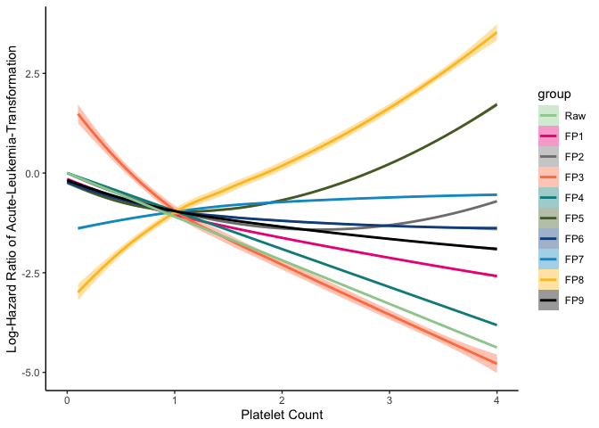
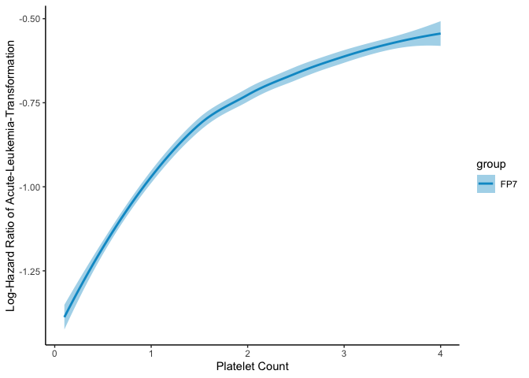

# Aim

This vignette aims to illustrate the function resampling developped in
our paper, but also to provide the results of the application
reproducible.

# Libraries and functions

This package requires the loading of the following libraries.

``` r
library(lattice)
library(CPMCGLM)
library(survival)
library(numbers)
library(SurvRegCensCov)
library(dplyr)
library(ggplot2)
library(compareGroups)
library(tidyr)
load("MPNmultistate.RData", envir=globalenv())
source("Fonctions_MFP.R")
```

# Motivating Example

## Datas

First, we will load, prepare, and descibe the database

``` r
#Extract data of interest


# Outcome: Time To Transformation (AMLTC (event), and AMLT (Time)), 
# Variable of Interest: Pl: , 
# Adjustment variables: Driver,ASXL1,TP53, White Count Cells (WCC), Hemoglobin (HB) and Age
data <- data.frame(na.omit(MPNinput[,c("Driver","Pl","Age","Hb","ASXL1","TP53","WCC","AMLT","AMLTC")]))

#Definition of covariable (Driver mutation) - Triple Negative versus Others
data$Driver1 <- as.numeric(paste((ifelse(data$Driver=="TN",0,1))))

data <- data[,-1]

# Summary of the dataset

res<-compareGroups(AMLTC ~ ., data=data)
createTable(res)
```

    ## 
    ## --------Summary descriptives table by 'AMLTC'---------
    ## 
    ## _________________________________________ 
    ##              0           1      p.overall 
    ##           N=1644       N=82               
    ## ¯¯¯¯¯¯¯¯¯¯¯¯¯¯¯¯¯¯¯¯¯¯¯¯¯¯¯¯¯¯¯¯¯¯¯¯¯¯¯¯¯ 
    ## Pl      0.79 (0.39) 0.69 (0.46)   0.052   
    ## Age     5.55 (1.62) 6.08 (1.02)  <0.001   
    ## Hb      1.43 (0.25) 1.27 (0.30)  <0.001   
    ## ASXL1   0.05 (0.22) 0.21 (0.41)   0.001   
    ## TP53    0.01 (0.11) 0.16 (0.37)   0.001   
    ## WCC     0.11 (0.07) 0.15 (0.16)   0.029   
    ## AMLT    3068 (2031) 2854 (2180)   0.386   
    ## Driver1 0.86 (0.34) 0.89 (0.31)   0.481   
    ## ¯¯¯¯¯¯¯¯¯¯¯¯¯¯¯¯¯¯¯¯¯¯¯¯¯¯¯¯¯¯¯¯¯¯¯¯¯¯¯¯¯

## Definition of fractional polynomials set

In this example, we will test 10 fractional polynomials (10 raws), with
a maximum of two degrees (2 columns). Then uner R software, the
dimension of the matrix for the definition of the fractional polynomials
(FP) will be (10×2).

``` r
FP <- matrix(NA,ncol=2,nrow=10)
FP[1,1] <- 1
FP[2,] <- c(0.5,1)
FP[3,] <- c(2,1)
FP[4,] <- c(-1,1)
FP[5,] <- c(1,1)
FP[6,] <- c(2,0.5)
FP[7,] <- c(1,0.5)
FP[8,] <- c(-1,-0.5)
FP[9,] <- c(2,-0.5)
FP[10,] <- c(0.5,0.5)
```

We can visualize the shape of the effect of different fractional
polynomials on the graph below.

    ## Warning: Removed 3 rows containing non-finite values (stat_smooth).



## Determination of the FP of interest

We will now call the R function developped to determine the fractional
polynomial of interest that seems best to describe the shape of the
effect between the number of platelets and the time before a leukemic
transformation among the patients of the database. This fractional
polynomial will be determined as the one with the lowest pvalue among
the set of fractional polynomials defined in the FP matrix. This
function provides the pvalue adjusted for the multiplicity of tests
induced by this pratice.

``` r
# Using Permutation method
res <- resampling(formula=Surv(AMLT, AMLTC)~Age+Pl+Driver1+ASXL1+TP53+WCC,data=data,varcod="Pl",FP=FP,N=2000,txcensure=0,method="Permutation",alpha=0.05)
```

    ## Warning in coxph.fit(X, Y, istrat, offset, init, control, weights = weights, : Loglik converged before variable
    ## 1 ; coefficient may be infinite.

    ## Warning in coxph.fit(X, Y, istrat, offset, init, control, weights = weights, : Loglik converged before variable
    ## 1 ; coefficient may be infinite.

    ## Warning in coxph.fit(X, Y, istrat, offset, init, control, weights = weights, : Loglik converged before variable
    ## 2 ; coefficient may be infinite.

    ## Warning in coxph.fit(X, Y, istrat, offset, init, control, weights = weights, : Loglik converged before variable
    ## 1 ; coefficient may be infinite.

    ## Warning in coxph.fit(X, Y, istrat, offset, init, control, weights = weights, : Loglik converged before variable
    ## 2 ; coefficient may be infinite.

    ## Warning in coxph.fit(X, Y, istrat, offset, init, control, weights = weights, : Loglik converged before variable
    ## 2 ; coefficient may be infinite.

    ## Warning in coxph.fit(X, Y, istrat, offset, init, control, weights = weights, : Loglik converged before variable
    ## 1 ; coefficient may be infinite.

    ## Warning in coxph.fit(X, Y, istrat, offset, init, control, weights = weights, : Loglik converged before variable
    ## 1 ; coefficient may be infinite.

``` r
res
```

    ## $Conclusion
    ## [1] "Based on permutation method,  the fractionnal polynomial number 8 ,is selected with a p.value= 0.0105"
    ## 
    ## $BestPF
    ## [1] -1.0 -0.5
    ## 
    ## $raw.pval
    ##  [1] 0.007708225 0.005263476 0.008106978 0.024920814 0.004855775 0.005656346 0.005263476 0.002313778 0.025715983
    ## [10] 0.006262415

``` r
#Using Boostsrap method
res <- resampling(formula=Surv(AMLT, AMLTC)~Age+Pl+Driver1+ASXL1+TP53+WCC,data=data,varcod="Pl",FP=FP,N=2000,txcensure=0,method="Bootstrap",alpha=0.05)
```

    ## Warning in coxph.fit(X, Y, istrat, offset, init, control, weights = weights, : Loglik converged before variable
    ## 1 ; coefficient may be infinite.

    ## Warning in coxph.fit(X, Y, istrat, offset, init, control, weights = weights, : Loglik converged before variable
    ## 1 ; coefficient may be infinite.

    ## Warning in coxph.fit(X, Y, istrat, offset, init, control, weights = weights, : Loglik converged before variable
    ## 2 ; coefficient may be infinite.

``` r
res
```

    ## $Conclusion
    ## [1] "Based on bootstrap method,  the fractionnal polynomial number 8 , is selected with a p.value= 0.0105"
    ## 
    ## $BestPF
    ## [1] -1.0 -0.5
    ## 
    ## $raw.pval
    ##  [1] 0.007708225 0.005263476 0.008106978 0.024920814 0.004855775 0.005656346 0.005263476 0.002313778 0.025715983
    ## [10] 0.006262415

In this example, the resampling function returns three items, regardless
of the resampling method chosen. The first corresponds to a conclusion
sentence, the second recalls the powers of the optimal fractional
polynomials, and the last recall the unadjusted pvalues corresponding to
the different fractional polynomials tested. In this example, the shape
of the most relevant effect among those tested corresponds to the 8th
fractional polynomial. It is a fractional polynomial of degree 2, with
respective powers -1, and -0.5. The adjusted pvalue obtained for both
resampling methods is 0.0105. The shape of this effect corresponding to
the selected fractional polynomial is shown in the following figure.

    ## Warning: Removed 1 rows containing non-finite values (stat_smooth).


